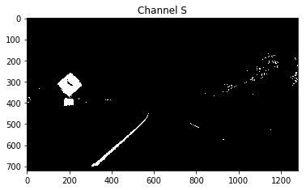
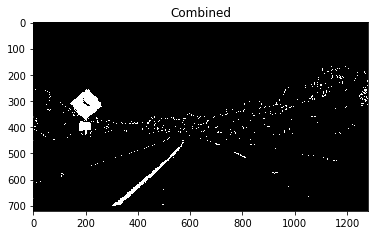
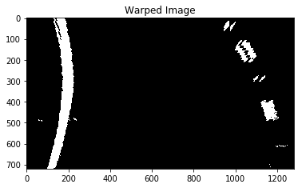

##Writeup Template
###You can use this file as a template for your writeup if you want to submit it as a markdown file, but feel free to use some other method and submit a pdf if you prefer.

---

**Advanced Lane Finding Project**

The goals / steps of this project are the following:

* Step 1: Computing the camera calibration matrix and distortion coefficients given a set of chessboard images.
* Step 2: Applying the distortion correction from the step 1 to raw images
* Step 1: Using gray-scale transforms and gradients with a set of thresholdeds to create binary image.
* Step 2: Applying a perspective transform to rectify binary image ("birds-eye view")
* Step 3: Detecting lane pixels and fit to find the lane boundary using histogram information and sliding widnows
* Step 4: Calculating the curvature of the lane and vehicle position with respect to center.
* Step 5: Warp the detected lane boundaries back onto the original image.
* Step 6: Output visual display of the lane boundaries and numerical estimation of lane curvature and vehicle position.

Goals:
* Developing a robust pipeline to detect laneline on road tracks
* Detecting outliers and how they affect the lines

## Steps Explained

###Camera Calibration

In order to prepare input images for line detection, first it needs to be undistorted. I used the provided chessboard images in folder `camera-cal` of this project to collect detected coreners of gray-scaled chessboard images using opencv method `cv2.findChessboardCorners`. For internal corners I used 9x6 grid and prepared a default object-point with the same size, which wil be appended to list of object-points everytime all corners of a chesshboard image is detected, corners will be appended to image-points accordingly. 
Collected points are then passed to `cv2.calibrateCamera()` to get camera-matrix and distortion-coefficients in order to undistort images using `cv2.undistort()`, here are some of the successfully detected corners:
<table style="width:100%">
  <tr>
    <td></td>
    <td></td>
    <td></td>
  </tr>
</table>


Note: 9x6 corners failed on finding corners for the following images:

* camera_cal/calibration1.jpg
* camera_cal/calibration4.jpg
* camera_cal/calibration5.jpg

I used the first image to test my undistortion method, and here is the result
<table style="width:100%">
  <tr>
    <td>Original</td>
    <td>Undistorted</td>
  </tr>
  <tr>
    <td></td>
    <td></td>
  </tr>
</table>

###Binarization

I used a combination of 2 transformations:

 * 1- HLS Thresholding: raw image is converted to HLS channel to only keep channel `s` and I applied a threshold of [90,200]  as it does a fairly robust job of picking up the lines under very different color and contrast conditions.
 * 2- Gradient Thresholding: raw image is converted to gray-scale and I used sobel operator in `x` orientations to find image emphasising edges vertically, threshold applied in this case [90,200].
 
 output of these 2 are then combined into 1 set of points:
 
 <table style="width:100%">
  <tr>
    <td>Original</td>
    <td>Sobel X</td>
    <td>HLS (S)</td>
    <td>Combined</td>
    
  </tr>
  <tr>
    <td></td>
    <td></td>
    <td></td>
    <td></td>
  </tr>
</table>
 

###Perspective Transform

I selected four source points for perspective transform to get an approximation as a region where lanes tend to appear.With perspective transform this region is trasnformed to bird's eye view perspective where lines look parallel and vertical.
 <table style="width:100%">
  <tr>
    <td>Original</td>
    <td>Region</td>
    <td>Binariezed</td>
    <td>Perspective Transform</td>
  </tr>
  <tr>
    <td></td>
    <td></td>
    <td></td>
    <td></td>
  </tr>
</table>

###Finding fits for the lines

After bringing the most important region of the image into focus it's time to decide explicitly which pixels are part of the lines and which belong to the left line and which belong to the right line.

For this step, I draw histogram of the lower half of the warped image as it has the starting pixels of the lines. Histogram would display the two most prominent peaks with spikes in x-axis and these will be of the base of the lane lines. From that point, I use a sliding window, placed around the line centers, to find and follow the lines up to the top of the frame.
The strategy to use base-lines is to divide image into multiple windows from y-axis and process each slide from bottom to the top to find good pixels and adjust the lines for the next slide.
Every time 50 pixels are detected in a slide, base-lines are moved to the average point of these pixels to be able to capture curves more precisley. All the good points are collected as a list and passed to polyfit to generate coefficents for drawing left & right lines.

 <table style="width:100%">
  <tr>
    <td>Histogram</td>
    <td>Sliding Windows</td>
  </tr>
  <tr>
    <td></td>
    <td></td>
  </tr>
</table>

 
 
 
###Pipeline (single images)

####1. Provide an example of a distortion-corrected image.
To demonstrate this step, I will describe how I apply the distortion correction to one of the test images like this one:
![alt text][image2]
####2. Describe how (and identify where in your code) you used color transforms, gradients or other methods to create a thresholded binary image.  Provide an example of a binary image result.
I used a combination of color and gradient thresholds to generate a binary image (thresholding steps at lines # through # in `another_file.py`).  Here's an example of my output for this step.  (note: this is not actually from one of the test images)

![alt text][image3]

####3. Describe how (and identify where in your code) you performed a perspective transform and provide an example of a transformed image.

The code for my perspective transform includes a function called `warper()`, which appears in lines 1 through 8 in the file `example.py` (output_images/examples/example.py) (or, for example, in the 3rd code cell of the IPython notebook).  The `warper()` function takes as inputs an image (`img`), as well as source (`src`) and destination (`dst`) points.  I chose the hardcode the source and destination points in the following manner:

```
src = np.float32(
    [[(img_size[0] / 2) - 55, img_size[1] / 2 + 100],
    [((img_size[0] / 6) - 10), img_size[1]],
    [(img_size[0] * 5 / 6) + 60, img_size[1]],
    [(img_size[0] / 2 + 55), img_size[1] / 2 + 100]])
dst = np.float32(
    [[(img_size[0] / 4), 0],
    [(img_size[0] / 4), img_size[1]],
    [(img_size[0] * 3 / 4), img_size[1]],
    [(img_size[0] * 3 / 4), 0]])

```
This resulted in the following source and destination points:

| Source        | Destination   | 
|:-------------:|:-------------:| 
| 585, 460      | 320, 0        | 
| 203, 720      | 320, 720      |
| 1127, 720     | 960, 720      |
| 695, 460      | 960, 0        |

I verified that my perspective transform was working as expected by drawing the `src` and `dst` points onto a test image and its warped counterpart to verify that the lines appear parallel in the warped image.

![alt text][image4]

####4. Describe how (and identify where in your code) you identified lane-line pixels and fit their positions with a polynomial?

Then I did some other stuff and fit my lane lines with a 2nd order polynomial kinda like this:

![alt text][image5]

####5. Describe how (and identify where in your code) you calculated the radius of curvature of the lane and the position of the vehicle with respect to center.

I did this in lines # through # in my code in `my_other_file.py`

####6. Provide an example image of your result plotted back down onto the road such that the lane area is identified clearly.

I implemented this step in lines # through # in my code in `yet_another_file.py` in the function `map_lane()`.  Here is an example of my result on a test image:

![alt text][image6]

---

###Pipeline (video)

####1. Provide a link to your final video output.  Your pipeline should perform reasonably well on the entire project video (wobbly lines are ok but no catastrophic failures that would cause the car to drive off the road!).

Here's a [link to my video result](./project_video.mp4)

---

###Discussion

####1. Briefly discuss any problems / issues you faced in your implementation of this project.  Where will your pipeline likely fail?  What could you do to make it more robust?

Here I'll talk about the approach I took, what techniques I used, what worked and why, where the pipeline might fail and how I might improve it if I were going to pursue this project further.  

