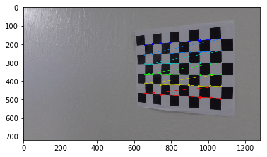
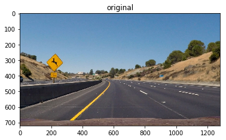

**Advanced Lane Finding Project**

The goals / steps of this project are the following:

* Step 1: Computing the camera calibration matrix and distortion coefficients given a set of chessboard images.
* Step 2: Applying the distortion correction from the step 1 to raw images
* Step 1: Using gray-scale transforms and gradients with a set of thresholdeds to create binary image.
* Step 2: Applying a perspective transform to rectify binary image ("birds-eye view")
* Step 3: Detecting lane pixels and fit to find the lane boundary using histogram information and sliding widnows
* Step 4: Calculating the curvature of the lane and vehicle position with respect to center.
* Step 5: Warp the detected lane boundaries back onto the original image.
* Step 6: Output visual display of the lane boundaries and numerical estimation of lane curvature and vehicle position.

Goals:
* Developing a robust pipeline to detect laneline on road tracks

## Steps Explained

### 1- Camera Calibration

In order to prepare input images for line detection, first it needs to be undistorted. I used the provided chessboard images in folder `camera-cal` of this project to collect all detected coreners of gray-scaled chessboard images using opencv method `cv2.findChessboardCorners`. For internal corners I used 9x6 grid and prepared a default object-point with the same size, which wil be appended to list of object-points everytime all corners of a chesshboard image is detected, corners will be appended to image-points accordingly. 
Collected points are then passed to `cv2.calibrateCamera()` to get camera-matrix and distortion-coefficients to undistort images by using `cv2.undistort()`, here are some of the successfully detected corners:
<table style="width:100%">
  <tr>
    <td></td>
    <td></td>
    <td></td>
  </tr>
</table>


Note: 9x6 corners failed on finding corners for the following images:

* camera_cal/calibration1.jpg
* camera_cal/calibration4.jpg
* camera_cal/calibration5.jpg

I used the first failed checssboard image to test my undistortion metrics, and here is the result
<table style="width:100%">
  <tr>
    <td></td>
  </tr>
</table>

### 2- Binarization

For simplifying images and focusing only on certain features of the road, I combined 2 transformations:

 * 1- HLS Thresholding: raw image is converted to HLS channel to only keep channel `s` and I applied a threshold of [90,200]  as it does a fairly robust job of picking up the lines under very different color and contrast conditions.
 * 2- Gradient Thresholding: raw image is converted to gray-scale and I used sobel operator in `x` orientations to find image emphasising edges vertically, threshold applied in this case [90,200].
 
 output of these 2 are then combined into 1 set of points:
 
 <table style="width:100%">
  <tr>
    <td>Original</td>
    <td>Sobel X</td>
    <td>HLS (S)</td>
    <td>Combined</td>
    
  </tr>
  <tr>
    <td></td>
    <td></td>
    <td></td>
    <td></td>
  </tr>
</table>
 

### 3- Perspective Transform

I selected four source points for perspective transform to get an approximation as a region where lanes tend to appear.With perspective transform this region is trasnformed to bird's eye view perspective where lines look parallel and vertical.
 <table style="width:100%">
  <tr>
    <td>Original</td>
    <td>Region</td>
    <td>Binarized</td>
    <td>Perspective Transform</td>
  </tr>
  <tr>
    <td></td>
    <td></td>
    <td></td>
    <td></td>
  </tr>
</table>

### 4- Finding fits for the lines

After bringing the most important region of the image into focus, it's time to decide explicitly which pixels are part of the lines and which belong to the left line or to the right line.

For this step, I plotted histogram of the lower half of the warped image, because it has the starting pixels of the lines. Histogram displays the two most prominent peaks with spikes in x-axis and these pixels are the base of the lane lines. From that point, I use a sliding window, placed around the line centers wiht margin of `100px`, to find pixels and follow them to find the trace of lines up to the top of the frame.
I use base-lines and with the image divided into multiple windows vertically, I process each slide from bottom to the top to find good pixels and adjust the lines for the next slide.
Every time `50px` are detected in a slide, base-lines move to the average point of these pixels so it would be easier to capture curves more precisley. All the good points are collected as a list and passed to polyfit to generate coefficents for drawing left & right lines.

 <table style="width:100%">
  <tr>
    <td>Histogram</td>
    <td>Sliding Windows</td>
  </tr>
  <tr>
    <td></td>
    <td></td>
  </tr>
</table>

### 5- Draw lines on original image

The final step is projecting the measurement back onto the original image. I used the inversed prespective-transform Matrix that was generated in step 3 to trasform the lines onto the original view.
 
<table style="width:100%">
  <tr>
    <td></td>
  </tr>
</table>
 
### Pipeline (single images)

As mentioned in previous section, each frame of image goes thorugh 5 main steps:

First, image is undistorted using callibration matrix and distortion coefficients from chessboard images. The image is then binarized through combination of gradient sobelx and saturation channel in HLS. To get perspective transform, I marked a region on image where lanes usually appear and warped them to bird's eye view using `offset=200`:

| Source       | Destination   | 
|:------------:|:-------------:| 
| 520,520      | 200, 200      | 
| 830,520      | 1260, 200     |
| 1150,690     | 1260, 520     |
| 300,690      | 200, 520      |

```
//image size : (720, 1280)
destination_vertices: [[offset,offset],[img_size[1]-offset,offset],[img_size[1]-offset,img_size[0]-offset],[offset,img_size[0]-offset]]
```

Next, warped-image is passed to my module `sliding_window_histogram` to find line-fits, as explained earlier I split the warped-image into halves, and draw histogram of the lower half becuase it has the starting pixels of the lines. Histogram contains information about the two most prominent peaks with spikes in x-axis. From that point, I use a sliding window, placed around the line centers, to find and follow the lines up to the top of the frame.
I divide the warped-image into 9 windows from y-axis and start processing slides from the bottom to the top to find good pixels and adjust the center-lines for the next slide.
With pixel-threshold of 50 pixels, I decide to whether adjust my center-line based on new findings or not. If the condition met in a slide, center-lines are adjusted to the average point of these pixels which enables me to capture curves more precisley. All the good points are collected as a list and passed to polyfit to generate coefficents for drawing left & right lines.

After the line-fits are calculated, I create 2 Line() instances for the left & the right line. Line class holds some feature-information for doing frame correction in processing a sequence of images. I also keep all the good lines in a list for comparison and correction purposes of upcoming frames.

Some of the main featres I keep my eyes on are:

    * `line_base_pos` : the position of the line relative to the center of the image; to check the position of the line with previous frame within an offset to avoid jumps
    * `radius_of_curvature`: curve of the line; to check the cruve of the line with previous frame to avoid jumps
    * `current_fit`: line coefficients; to keep track of current frame for next new frames in case I need to adjust the new frame
    * `allx` & `ally`: all x and y points of the line; to keep track of current fit to do further adjustments for new frames if necessary

As frames populate these class variables I check 3 conditions:

* 1- I check for position to be in `~1(meter)` offset from the center of the frame. For measuring this distance I take the absoloute difference between the center of frame on horizontal axis (y=0) and the correlated point with y=0 of the fit-line (right or left).

* 2- Additionaly, I estimate an approximate slope-value with an offset of `0.15` based on the derivative and fit-coefficients of the previous-frame. For calculating the slope I took the derivative of the fit Ay^2+By+C -> 2*Ay + B, and pass the vertical-center of the frame (height/2) to get an estimate for the slope. 

* 3- Lastly I compare current curve with the previous-frame's curve with offset of `50` and doesn't exceed `1000m`. For calculating the radius curve I used the project guidelines, by taking 1st and 2nd order derivates of Ay^2 + By +C and applying them to the formula below:

`R-curve= ((1+(2Ay+B)^2)^(3/2))/∣2A∣`

If all conditions are satisfied, frame is a good match and will be appended to my list of line-instances.

If a line didn't meet the criteria, I'll copy the previous-frame's features such as coefficients, allx & ally to recalculate the fit & curves and slopes.

Finally I cast the lines onto the original frame and move on to the next frame.

Here's a full flow of original image through the entire pipeline:

<table style="width:100%">
  <tr>
    <td>Original</td>
    <td>Undistorted</td>
    <td>Gradient Sobel x Transform</td>
  </tr>
  <tr>
    <td></td>
    <td></td>
    <td></td>
  </tr>
  <tr>
    <td>HLS (S) Transform</td>
    <td>Combined HLS & Sobelx</td>
    <td>Region</td>
  </tr>
  <tr>
    <td></td>
    <td></td>
    <td></td>
  </tr>
  <tr>
    <td>Warped</td>
    <td>Histogram</td>
    <td>Sliding Windows</td>
  </tr>
  <tr>
    <td></td>
    <td></td>
    <td></td>  
  </tr>
  <tr>
      <td>output</td>
  </tr>
  <tr>
    <td></td>
  </tr>
</table>

### Challenge Vidoes:

In the frist challenge video, I noticed that low-contrast in challenge video frames usually results in no lane detection specifically on the left side which results in a distorted left-fitx , as shown in the last image of the sequence below:

<table>
  <tr>
    <td>Origianl</td>
    <td>Undistorted</td>
    <td>Gradient Sobel x Transform</td>
  </tr>
   <tr>
    <td></td>
    <td></td>
    <td></td>
  </tr>
  <tr>
    <td>HLS (S) Transform</td>
    <td>Combined HLS and Sobelx</td>
  </tr>
  <tr>
    <td></td>
    <td></td>
  </tr>
  <tr>
    <td>Histogram</td>
    <td>Sliding Windows</td>
  </tr>
  <tr>
    <td></td>
    <td></td>  
  </tr>
</table>

So as a further correction, I added another condition to my pipeline in the sliding-windows-histogram module where I find the fit-coeffcinets for the lines. I checked for the length of nonzero points for left and right individually, if one of them has less than `500` points whereas the other one has more than `500` points, I manipulate the weaker line with the stronger line and create a parallel polynomial fit, here is the hack:

For fixing the right line based on the left values, I used the same coefficients but shiftted it to the right by almost 2/3rd of the image width

```
right-fitx = left-fit[0] * ploty**2 + left-fit[1]*ploty + left-fit[2] + 2*int(img.shape[1]/3)-50
right_fit = np.array([left_fit[0], left_fit[1], left_fit[2] + 2*int(img.shape[1]/3)-50])
rightx = rightx + 2*int(img.shape[1]/3)
righty = righty
```

For fixing the left line based on the right values, I still use the same coefficients but shift it to the left by almost 2/3rd of the image width

```
left_fitx = right_fit[0]*ploty**2 + right-fit[1]*ploty + right_fit[2] - 2*int(img.shape[1]/3)+50
left_fit = np.array([right_fit[0], right_fit[1], right_fit[2] - 2*int(img.shape[1]/3)+50])
leftx = rightx -2*int(img.shape[1]/3)
lefty = righty
```

By applying this fix, I was able to get a much better result for the weak lines:

<table>
  <tr>
    <td>Without fix</td>
    <td>With fix</td>
  </tr>
  <tr>
    <td></td>
    <td></td>  
  </tr>
</table>

And for the final challenge I ended up shrinking the height selected region becuase of sharp curves as well as
the width to fit within the lanes, but sun reflection and flares are adding a lot of noise to the frames which makes it hard for the model to detect lines.

---

### Pipeline (video)

####  Final video output. 

Here's a [project_output](./project_output.mp4)

Challenge video [challenge_output](./challenge_output.mp4)

Harder Challenge [harder_challenge_output](./harder_challenge_output.mp4)

---

### Discussion

Although computer vision is a strong tool in lane detection; it is not enough for driving smoothly especially in curves and sudden road changes, in this set of experminets we're bound to whatever frames we have cached so far to do some minor corrections to upcoming frames. This would fail in a case where our very first captures contain noise and would damage new frames because of the criteria we have by comparing new images to averages and previous frames.

I checked the line positions to have an approximatly good distance from the center of the camera, also I avoid sudden slope changes by comparing the slope with the previous frame's slope and there are conditions to check the curve to be almost aligned with the previous frame and doesn't  exceed 1km. However the pipeline still lacks training phase, as next step I would like to combine this cv knowledge with deep learning techniques from last projects to get better and smarter corrections based on enough training data and patterns. 

